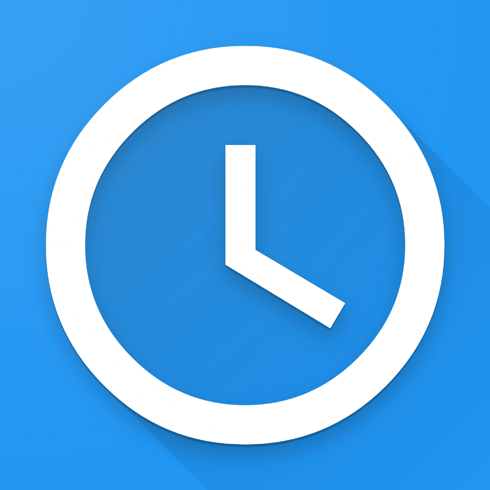

<a name="readme-top"></a>

<!-- PROJECT LOGO -->
<br />
<div align="center">
  <a href="https://github.com/eBouvard/simple-task-manager">
    
  </a>

<h3 align="center">Simple Task Manager</h3>

  <p align="center">
    A really simple task manager built with Vue.Js and Quasar.
    <br />
    <br />
    <a href="https://simple-task-manager-11f4b.web.app/">View Demo</a>
  </p>
</div>

<!-- TABLE OF CONTENTS -->
<details>
  <summary>Table of Contents</summary>
  <ol>
    <li>
      <a href="#getting-started">Getting Started</a>
      <ul>
        <li><a href="#prerequisites">Prerequisites</a></li>
        <li><a href="#installation">Installation</a></li>
      </ul>
    </li>
  </ol>
</details>

## Getting Started

This is an example of how you may give instructions on setting up your project locally.
To get a local copy up and running follow these simple example steps.

### Prerequisites

This is an example of how to list things you need to use the software and how to install them.

- npm

### Installation

1. Clone the repo
   ```sh
   git clone https://github.com/eBouvard/simple-task-manager.git
   ```
1. Install NPM packages
   ```sh
   npm install
   ```

### Start the app in development mode (hot-code reloading, error reporting, etc.)

```bash
npm run dev
```

### Build the app for production

```bash
npm run build
```

<p align="right">(<a href="#readme-top">back to top</a>)</p>
